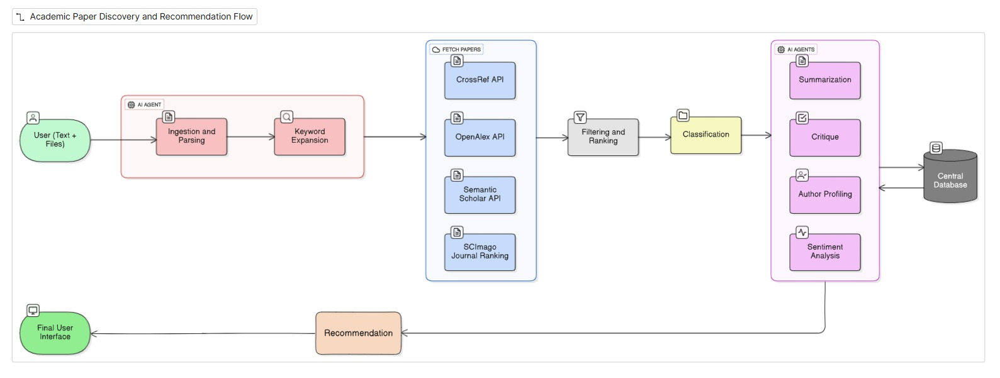
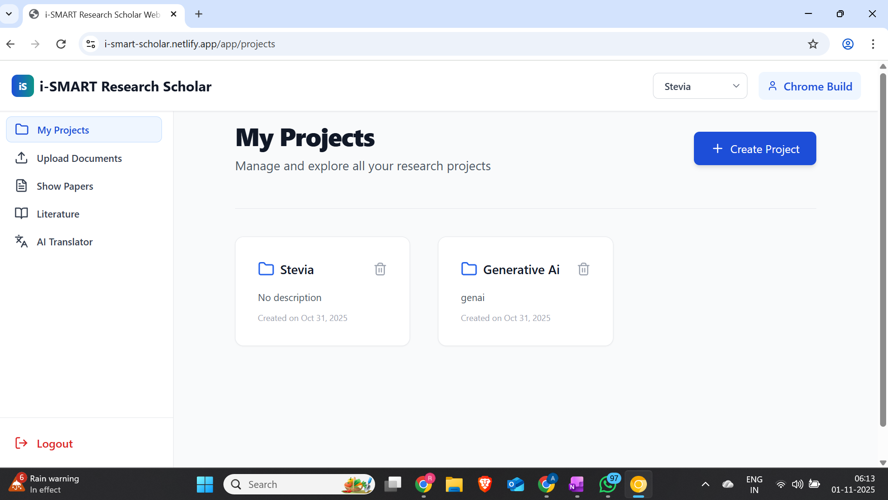
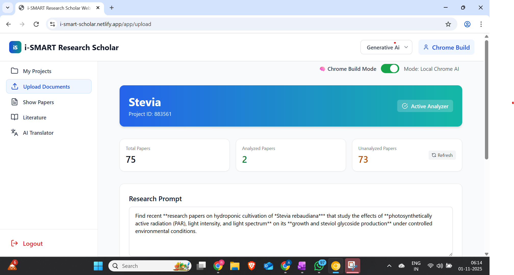
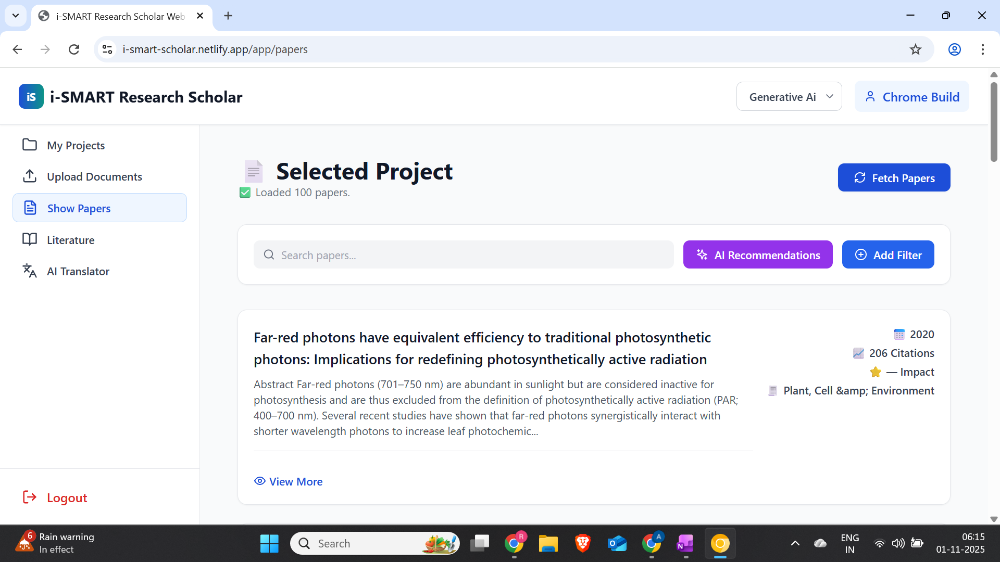
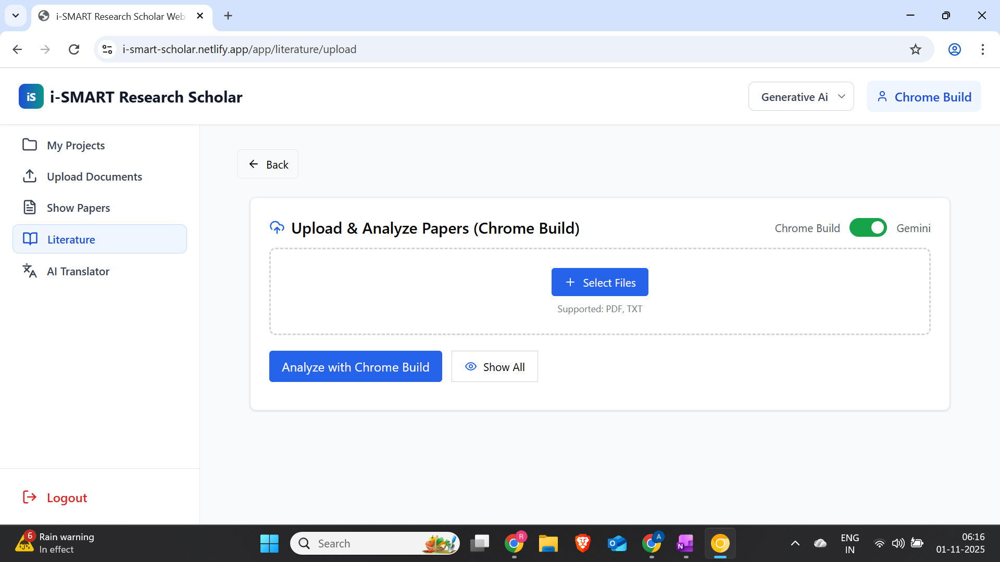
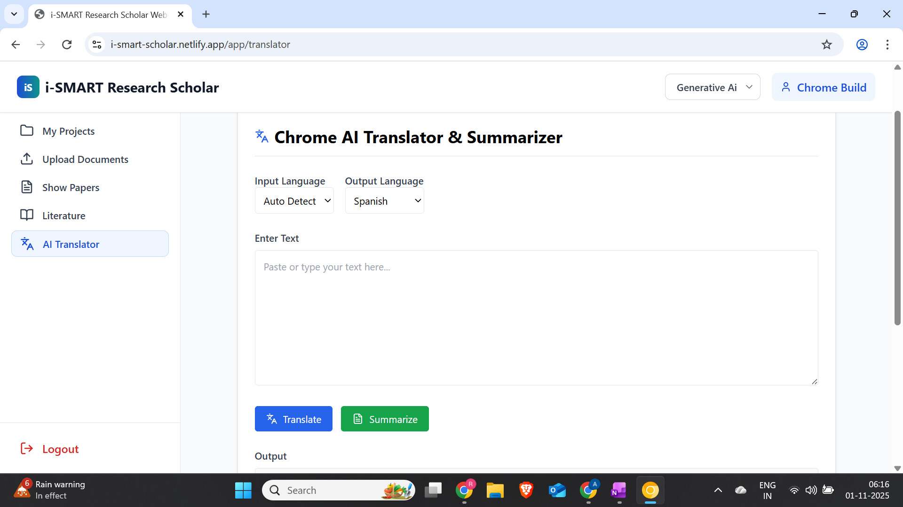

Here’s the cleaned, copy-paste-ready **README.md** with the **Database**, **Project Structure**, and **Development Tips** sections removed.

---

# 🧠 i-Smart ScholAR

*An AI-powered web application for smarter academic research and literature review*

---

## 📘 Overview

**i-Smart ScholAR** is an intelligent academic assistant that helps researchers and students **discover, analyze, and summarize** research papers using AI.
It integrates **Gemini**, **Chrome Built-in AI APIs**, and **LangChain** to automate research workflows — from **keyword generation** to **literature review synthesis** — all within an interactive web app.

---

## ⚡ Key Features

* ✅ AI-based **keyword generation** from prompts or PDFs
* ✅ **Smart paper discovery & ranking** by relevance
* ✅ **Instant summaries and translations** using Chrome Built-in AI
* ✅ **Automated literature review** with Gemini
* ✅ **Report export** in Markdown or PDF
* ✅ Runs directly in Chrome with built-in AI support

---

## 🧠 Core Technologies

| Layer                   | Tools / Frameworks                  |
| ----------------------- | ----------------------------------- |
| 💻 **Frontend**         | React.js, Vite, TailwindCSS         |
| ⚙️ **Backend**          | FastAPI, LangChain                  |
| 🧩 **AI Models / APIs** | Gemini API, Chrome Built-in AI APIs |
| 🗄️ **Database**        | MySQL                               |
| 🌐 **External API**     | OpenAlex (for research papers)      |

---

## 🏗️ System Architecture



**Flow:**

1. React frontend interacts with FastAPI backend via REST.
2. Backend integrates:

   * 🧠 **Gemini API** → Summarization, literature synthesis
   * ⚙️ **Chrome Built-in AI APIs** → Keyword generation, translation
   * 🔗 **LangChain** → Chaining and context handling
   * 🗄️ **MySQL** → Project data and metadata storage

---

## 🧩 Core Modules

### 1️⃣ Project Creation


Manage your research projects — create, edit, and switch between topics easily.

---

### 2️⃣ Keyword Generator


Generate keywords from prompts or PDFs using **Chrome Built-in AI** + **Gemini** for better search precision.

---

### 3️⃣ Paper List


Fetch and rank research papers by AI relevance. Quickly view abstracts, summaries, and key findings.

---

### 4️⃣ Literature Upload


Upload PDFs and let AI extract key points like **contribution**, **methods**, and **results** using Gemini.

---

### 5️⃣ Literature Review


Auto-generate a **structured literature review** divided into sections like:

* Introduction
* Related Work
* Key Themes
* Research Gaps
* Future Work

All synthesized intelligently via Gemini.

---

### 6️⃣ Translation


Translate abstracts, summaries, or reviews using **Chrome Built-in Translation API** — offline and instant.

---

## ⚙️ Setup Guide

### 🧩 Prerequisites

* 🐍 Python **3.9+**
* 🧱 Node.js **18+**
* 🐬 MySQL installed and running

---

### 🧠 Chrome AI Configuration

To use Chrome’s on-device AI features:

1. Open **Chrome Canary** (or the latest Chrome).
2. Visit: `chrome://flags`
3. Enable these flags:

   ```
   #prompt-api-for-gemini-nano
   #optimization-guide-on-device-model
   ```
4. Restart Chrome 🔁

> These enable local/on-device prompt APIs and models for instant keywording and translation.

---

### 🔐 Environment Variables

Create a `.env` in both **backend** and **frontend** as needed.

**Backend `.env` (example):**

```env
# Gemini / Google AI Studio
GEMINI_API_KEY=your_gemini_api_key


```

**Frontend `.env` (example):**

```env
VITE_BACKEND_URL=http://localhost:8000
```

---

## 🚀 Running Locally

### 1) Backend (FastAPI)

```bash
cd backend
pip install -r requirements.txt
uvicorn main:app --reload
```

* FastAPI will start at: **[http://localhost:8000](http://localhost:8000)**
* Docs: **[http://localhost:8000/docs](http://localhost:8000/docs)**

### 2) Frontend (React + Vite)

```bash
cd frontend
npm install
npm run dev
```

* Vite dev server runs at (default): **[http://localhost:5173](http://localhost:5173)**

> **Quick start summary:**
>
> * Start the backend: `uvicorn main:app --reload`
> * Start the frontend: `npm run dev`

---

## 🔗 API Highlights

* **/keywords** – Generate keywords from prompt or PDF (Chrome Built-in AI + Gemini)
* **/papers/search** – Query OpenAlex; rank & filter by relevance
* **/papers/summarize** – Summarize abstracts or full texts (Gemini)
* **/literature/review** – Auto-compose structured literature reviews
* **/translate** – Local translation via Chrome on-device APIs

*(Endpoints are illustrative; align with your actual routes.)*

---

## 📄 Export

* Export project summaries and literature reviews as **Markdown** or **PDF** from the UI.
* PDFs can be generated client-side (print-to-PDF) or server-side (if you add a renderer).

---


## 🙌 Acknowledgements


* **Gemini** for summarization & synthesis
* **Chrome Built-in AI** for local keywording & translation


---
